# Azure Automation Runtime Environment 7.x Investigation

## Overview

While testing Azure Automation Runtime Environment 7.x on Hybrid Workers, I encountered an unexpected behavior when migrating a runbook pattern that previously worked in PowerShell 5.1.

A parent runbook was able to invoke a local child script successfully in PowerShell 5.1:

```powershell
.\init-test-variables.ps1
```

However, the same implementation failed when executed using Runtime Environment 7.x.

This repository documents the investigation, testing methodology, findings, root cause analysis, and recommended migration approach.

---

## Objective

The purpose of this investigation was to understand:

- Why local child script invocation works in PowerShell 5.1
- Why the same pattern fails in Runtime Environment 7.x
- How Azure Automation executes child runbooks
- Authentication requirements between runbooks
- Hybrid Worker execution behavior
- Recommended migration patterns

---

## Environment

| Component | Version |
|------------|------------|
| Azure Automation | Cloud |
| PowerShell | 5.1 |
| PowerShell | 7.4 Runtime Environment |
| Execution Target | Hybrid Worker |
| Authentication | Managed Identity |

---

# Architecture

## PowerShell 5.1

```text
Main Runbook
    |
    +--> .\child.ps1
            |
            +--> Same Process
            +--> Same Context
```

## Runtime Environment 7.x

```text
Main Runbook
    |
    +--> Start-AzAutomationRunbook
                |
                +--> Separate Job
                +--> Separate Context
                +--> Separate Authentication
```

## Azure Automation Account

Created an Automation Account over the Central India region.

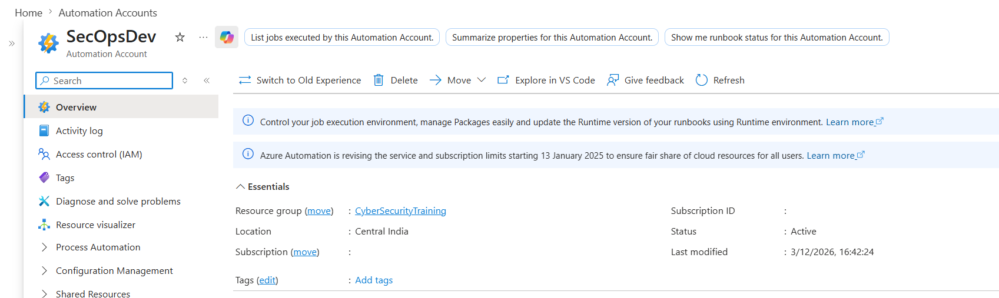

---

# PowerShell 5.1 Validation

## Child Runbook

Script:

```powershell
# Create a hashtable named $CommonVars to store values that can be shared
# with the parent runbook or other scripts.
$CommonVars = @{
    
    # Sample key-value pair.
    # Key   : Message
    # Value : "Hello from child runbook"
    Message = "Hello from child runbook"
}
# Return the hashtable to the calling runbook.
# The parent runbook can access the value using:
# $ReturnedVars.Message
return $CommonVars

```

Runbook Configuration:

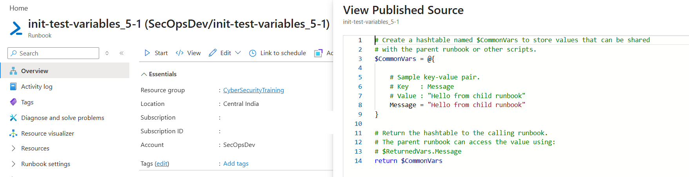

Execution Output:

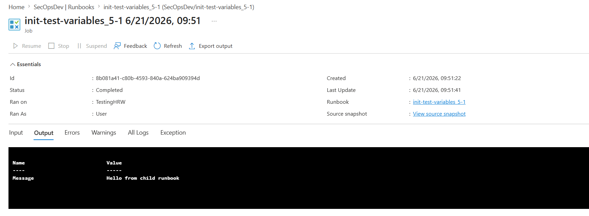

### Observation

The child runbook executed successfully and returned the expected output.

---

## Parent Runbook

Script:

```powershell
# Display the current working directory to verify where the runbook/script is executing from.
Write-Output "PWD = $(Get-Location)"
# List all PowerShell scripts (*.ps1) in the current directory.
# Useful for confirming that the child script is present and accessible.
Get-ChildItem . -Filter *.ps1 | Select Name
# Log a message indicating that the child script execution test is starting.
Write-Output "Testing local script call"
# Execute the child script and capture its output in the $ChildOutput variable.
$ChildOutput = .\init-test-variables_5-1.ps1
# Display the output returned by the child script.
Write-Output $ChildOutput

```

Runbook Configuration:

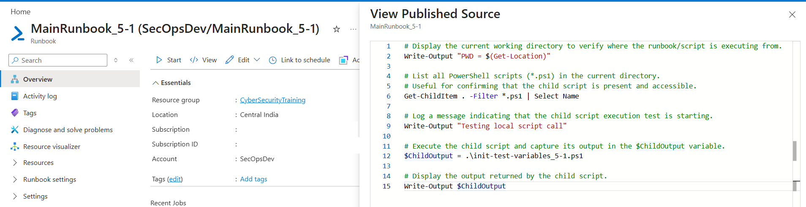

Execution Output:

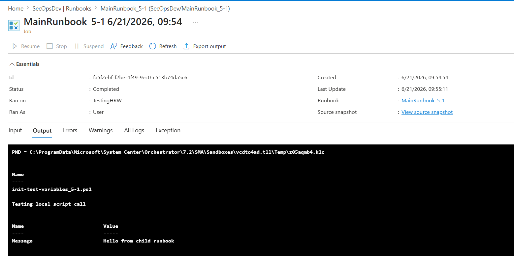

### Observation

The parent runbook successfully executed the child script using:

```powershell
.\init-test-variables.ps1
```

The child script executed within the same execution context.

---

# Runtime Environment 7.4 Validation

## Child Runbook

Runbook Configuration:

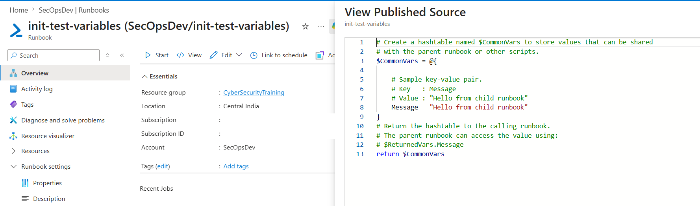

Execution Output:

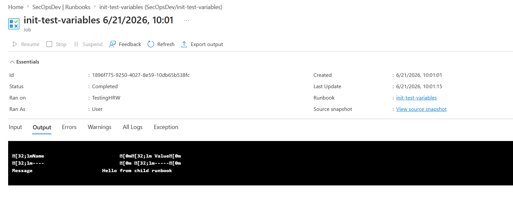

### Observation

The child runbook executed successfully when run independently.

---

## Parent Runbook

Runbook Configuration:

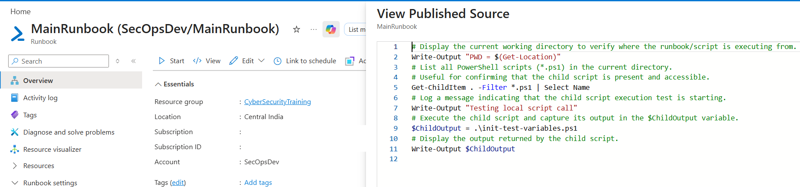

Execution Output:

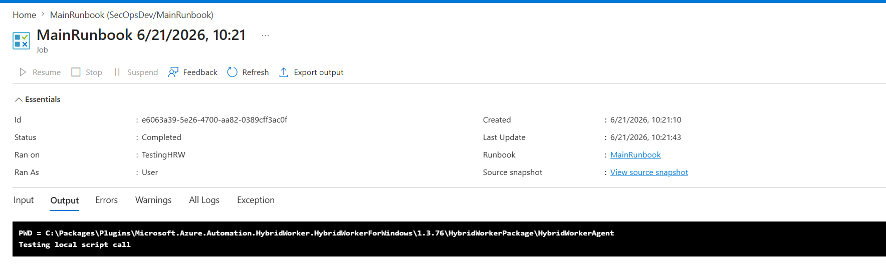

Error Encountered:

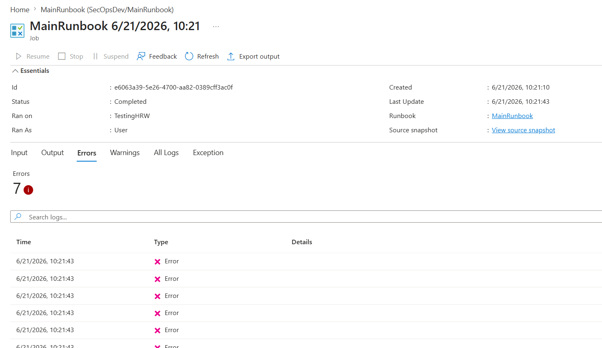

### Observation

The runbook failed when attempting to execute:

```powershell
.\init-test-variables.ps1
```

Error:

```text
The term '.\init-test-variables.ps1' is not recognized as a name of a cmdlet,
function, script file, or executable program.
```

---

# Local Directory Validation

To validate whether the issue was related to the execution environment, a test was performed to inspect the local directory accessible to the Runtime Environment. (C:\Packages\Plugins\Microsoft.Azure.Automation.HybridWorker.HybridWorkerForWindows\1.3.76\HybridWorkerPackage\HybridWorkerAgent)

Script:

```powershell
# Create a hashtable named $CommonVars to store values that can be shared
# with the parent runbook or other scripts.
$CommonVars = @{
    
    # Sample key-value pair.
    # Key   : Message
    # Value : "Hello from child runbook"
    Message = "Hello from child runbook"
}
# Return the hashtable to the calling runbook.
# The parent runbook can access the value using:
# $ReturnedVars.Message
return $CommonVars.Message
```

Output:

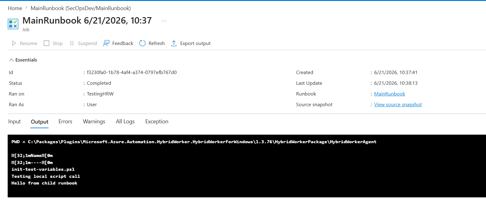

### Observation

The child script file was not available in the runtime execution directory.

This confirmed that Runtime Environment 7.4 could not locate the referenced script using a relative path.

---

# Microsoft Documentation Validation

Microsoft documentation was reviewed to verify supported child runbook execution patterns.

[Azure Automation Runbook Types](https://learn.microsoft.com/azure/automation/automation-runbook-types)

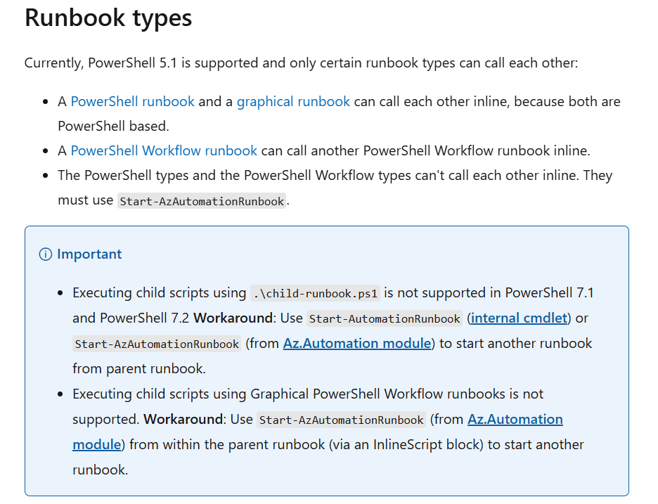

### Observation

The documented guidance aligns with using Azure Automation child runbooks rather than relying on local script execution patterns.
- [Start-AzAutomationRunbook](https://learn.microsoft.com/powershell/module/az.automation/start-azautomationrunbook)
- [Get-AzAutomationJobOutput](https://learn.microsoft.com/en-us/powershell/module/az.automation/get-azautomationjoboutput)
---

# Updated Runtime Environment 7.4 Implementation

Script:

```powershell
# Display the current working directory to verify where the runbook/script is executing from.
Write-Output "PWD = $(Get-Location)"
# List all PowerShell scripts (*.ps1) in the current directory.
# Useful for confirming that the child script is present and accessible.
Get-ChildItem . -Filter *.ps1 | Select Name
# Log a message indicating that the child script execution test is starting.
#//Write-Output "Testing local script call"
# Execute the child script and capture its output in the $ChildOutput variable.
#//$ChildOutput = .\init-test-variables.ps1
# Display the output returned by the child script.
#//Write-Output $ChildOutput
# Connect to Azure using Managed Identity
Connect-AzAccount -Identity
# Variables
$ResourceGroupName = "CyberSecurityTraining"
$AutomationAccountName = "SecOpsDev"
$ChildRunbookName = "init-test-variables"
# Start the child runbook
Write-Output "Starting child runbook: $ChildRunbookName"
$Job = Start-AzAutomationRunbook `
    -ResourceGroupName $ResourceGroupName `
    -AutomationAccountName $AutomationAccountName `
    -Name $ChildRunbookName
Write-Output "Child runbook started successfully."
Write-Output "Job ID: $($Job.JobId)"
# Wait for completion
do {
    Start-Sleep -Seconds 5
    $JobStatus = Get-AzAutomationJob `
        -ResourceGroupName $ResourceGroupName `
        -AutomationAccountName $AutomationAccountName `
        -Id $Job.JobId
    Write-Output "Current Status: $($JobStatus.Status)"
} while ($JobStatus.Status -eq "Running" -or $JobStatus.Status -eq "New" -or $JobStatus.Status -eq "Activating")
# Display final status
Write-Output "Final Status: $($JobStatus.Status)"
# Retrieve output records
$OutputRecords = Get-AzAutomationJobOutput `
    -ResourceGroupName $ResourceGroupName `
    -AutomationAccountName $AutomationAccountName `
    -Id $Job.JobId
# Retrieve actual output messages
Write-Output "===== CHILD RUNBOOK OUTPUT ====="
foreach ($Record in $OutputRecords)
{
    $Output = Get-AzAutomationJobOutputRecord `
        -ResourceGroupName $ResourceGroupName `
        -AutomationAccountName $AutomationAccountName `
        -JobId $Job.JobId `
        -Id $Record.StreamRecordId

    Write-Output $Output.Value
    Write-Output $Output.Value.Message
}
```

Execution Output:

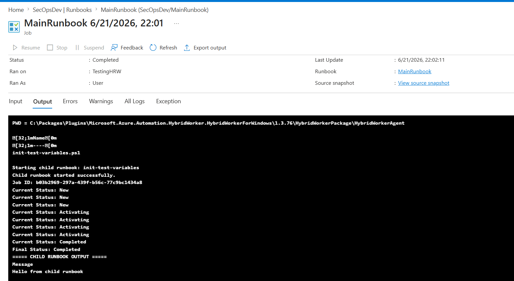

### Observation

Using:

```powershell
Start-AzAutomationRunbook
```

successfully executed the child runbook.

This approach aligns with Azure Automation Runtime Environment 7.x execution behavior.

---

# Hybrid Worker Observation

Execution behavior was further validated using Hybrid Workers.

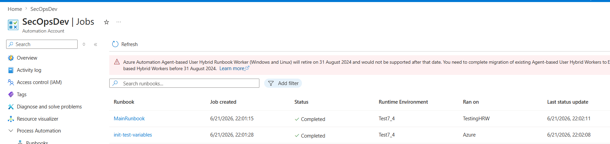

### Observation

A parent runbook executing on a Hybrid Worker does not automatically guarantee that a child runbook executes on the same worker.

Explicit worker targeting should be used when required.

---


### Key Difference

PowerShell 5.1 allows local script execution within the same execution context.

Runtime Environment 7.x introduces stronger execution isolation and encourages child runbooks to be executed as independent Azure Automation jobs.

---

# Key Findings

## Finding 1 – Child Runbooks Execute as Separate Jobs

When using:

```powershell
Start-AzAutomationRunbook
```

Azure Automation creates a separate job for the child runbook.

```text
Parent Runbook Job
        |
        +--> Start-AzAutomationRunbook
                    |
                    +--> Child Runbook Job
```

---

## Finding 2 – Execution Context Is Not Shared

The child runbook executes in its own execution context and should be treated as an independent workload.

To explicitly execute the child runbook on a Hybrid Worker, the **-RunOn** parameter should be provided:

```text
Start-AzAutomationRunbook `
    -Name "init-test-variables" `
    -RunOn "HybridWorkerName"
```

---

## Finding 3 – Authentication Must Be Explicit

Authentication established in the parent runbook is not automatically inherited by the child runbook.

Each runbook should establish its own authentication context.

```powershell
Connect-AzAccount -Identity
Start-AzAutomationRunbook ...
```
---

## Finding 4 – Hybrid Worker Execution Is Not Automatically Inherited

Running the parent runbook on a Hybrid Worker does not automatically guarantee that the child runbook executes on the same worker.

Explicit worker targeting should be used when required.

---

## Finding 5 – Runtime Environment 7.x Uses Stronger Isolation

Legacy PowerShell 5.1 patterns relying on local script execution should be reviewed before migration.

---

# Root Cause Analysis

The issue was not caused by a Runtime Environment 7.x defect.

The failure occurred because:

- The child script was not available in the Runtime Environment execution context.
- Relative path execution could not resolve the referenced script.
- Runtime Environment 7.x introduces stronger execution isolation than PowerShell 5.1.

As a result:

```powershell
.\init-test-variables.ps1
```

is not a reliable migration pattern.

---

# Recommended Solution

Use Azure Automation child runbooks instead of local script invocation.

Example:

```powershell
Connect-AzAccount -Identity

Start-AzAutomationRunbook `
    -ResourceGroupName "<ResourceGroupName>" `
    -AutomationAccountName "<AutomationAccountName>" `
    -Name "init-test-variables"
```

---

# Lessons Learned

- Validate PowerShell 5.1 child script patterns before migration.
- Do not assume authentication is shared.
- Explicitly verify Hybrid Worker execution paths.
- Treat child runbooks as independent jobs.
- Test execution behavior when moving to Runtime Environment 7.x.

---

# Conclusion

This investigation demonstrates an important behavioral difference between PowerShell 5.1 and Azure Automation Runtime Environment 7.x.

While local child script invocation may work in legacy implementations, Runtime Environment 7.x introduces stronger execution isolation and requires a different execution model.

The recommended approach is:

- Use `Start-AzAutomationRunbook`
- Treat child runbooks as independent jobs
- Establish authentication explicitly
- Explicitly specify Hybrid Worker execution when required

Understanding these execution boundaries is critical when modernizing Azure Automation solutions for Runtime Environment 7.x.

---


## Full Report

The complete investigation report can be downloaded below:

[📄 Download Investigation Report](docs/Automation-Azure.pdf)

Cloud Engineer | Azure Monitoring | Azure Automation | Microsoft Sentinel | Azure Arc | Hybrid Infrastructure

---

## References

Microsoft Documentation

- [Azure Automation Child Runbooks](https://learn.microsoft.com/en-us/azure/automation/automation-child-runbooks#runbook-types)
- [Start-AzAutomationRunbook](https://learn.microsoft.com/en-us/powershell/module/az.automation/start-azautomationrunbook)
- [Get-AzAutomationJobOutput](https://learn.microsoft.com/en-us/powershell/module/az.automation/get-azautomationjoboutput)

# Author

**Avijit Dutta**
